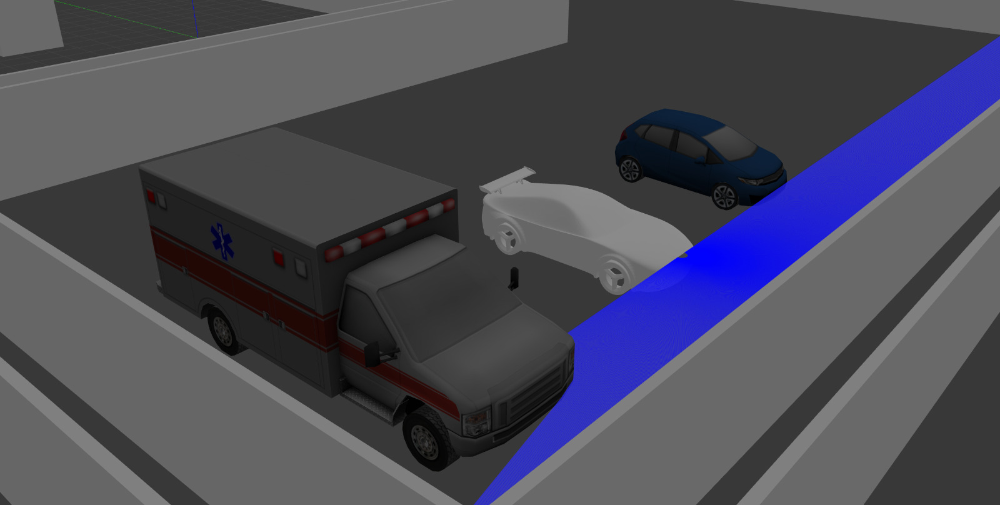
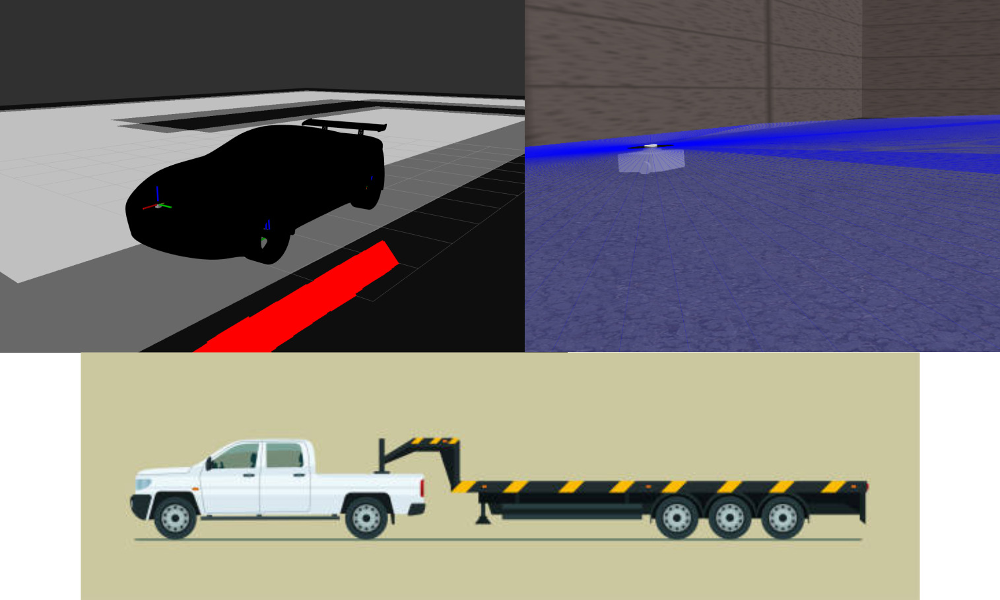
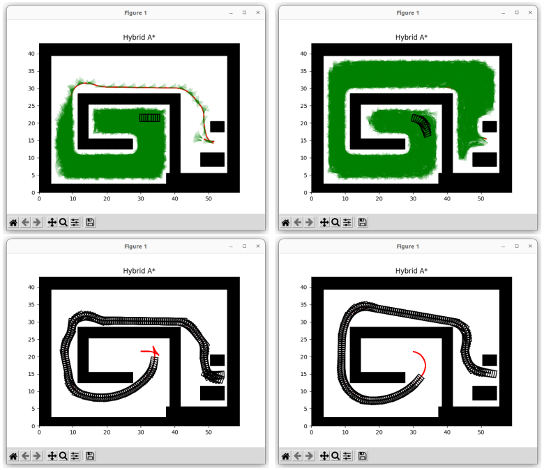

# Kinematic planning under Nonholonomic Constraints

<!-- ABOUT THE PROJECT -->
## About The Project

This report presents the results of implementing a kinematic path planner to park three vehicles of increasing complexity into a tight space. The vehicles - a
delivery robot, car, and truck with trailer - each have different steering constraints. A simulated 2D environment was created with obstacles, and configurations space
was modeled accounting for nonholonomic constraints. Custom path planning algorithms generated feasible paths satisfying kinodynamic constraints to maneuver
each vehicle from a start position into the target parking spot. The planned paths are presented along with snapshots visualizing the parking maneuvers. Though sim-
plistic, this project demonstrates automated parking for nonholonomic vehicles in cluttered environments.

## Introduction

This project involves developing path planning algorithms to park vehicles in a cluttered environment. The objective is to maneuver three vehicles - each with different steering
constraints - from a start position to a tight parking spot, while avoiding collisions. This is a common challenge faced by autonomous vehicles operating in urban environments.
The simulated 2D world consists of a parking lot with obstacles flanking the target parking space on two sides. Additionally, there are multiple obstruction in the middle of
the lot. The vehicles must navigate around these obstacles and utilize their full range of steering motion to efficiently park in the compact spot. The three vehicles of increasing complexity are:
• Delivery robot: Differential drive/skid steering
• Car: Ackermann steering
• Truck with trailer: Ackermann steering plus trailer kinematics
Each vehicle has kinodynamic constraints in the form of nonholonomic constraints dictated by its steering mechanism. The path planner utilizes a hybrid A* algorithm which
takes into account these constraints to generate feasible trajectories. This project demonstrates automated parking for vehicles with different steering con figurations in 
a constrained space using a custom motion planning algorithm.

## Methods

The path planning approach taken involves using a hybrid A* search algorithm to generate optimal trajectories for parking each vehicle. This extends the traditional A* graph search
by incorporating kinodynamic constraints in the cost function.
• Simulation
The complete parking scenario was simulated using pyplot as well as ROS2 and Gazebo. Pyplot provided ease in visualizing and working on algorithms in 2D en-
vironment and ROS2 provided the infrastructure for controlling the vehicles and visualizing the environment. Gazebo handled the physics simulation and rendering.
• Collision Checking
Continuous spaces are mathematically challenging to work with, especially when planning paths and performing collision checks. Discretizing the space simplifies
the problem by dividing it into smaller, manageable states. It allows the algorithm to check for collisions with obstacles by examining a finite number of states, rather
than continuously evaluating the entire continuous space.
• Discrete Motion Planning with Nonholonomic Constraints
Kinodynamic planning is crucial for vehicles and robots with non-holonomic constraints, such as cars, or robots with differential drive systems. These systems
cannot instantly change their velocity or direction and have specific dynamics that must be considered to plan feasible trajectories. The diagram and explanation on
this topic is given in the appendix section.
• Hybrid A-star algorithm
The path planning approach taken involves use of a hybrid A* search algorithm to generate optimal trajectories for parking each vehicle. This extends the traditional
A* graph search by incorporating kinodynamic constraints in the cost function. At each iteration, the algorithm considers reachable configurations based on the
vehicle’s kinematics. It selects the lowest cost node based on the A* evaluation function: f(n) = g(n) + h(n). The function g(n) represents the path cost from
start to node n, while h(n) estimates the cost to reach the goal. The kinodynamic constraints are encoded in g(n) to prune infeasible motions.
This process repeats, expanding nodes until the goal is reached. The optimal path minimizing traversal cost while satisfying steering constraints is then extracted. This
path is converted to a time-parameterized trajectory using the kinematic model. The complete scenario is simulated in matplotlib and ROS2 with Gazebo managing the
physics and visualizing the environment.

## Results

The hybrid A* path planner successfully generated collision-free trajectories to park all three vehicles in the allotted space.
For the delivery robot, a smooth path was produced utilizing the differential drive constraints to neatly maneuver around the obstacles to the goal position. The planned
path is shown in Figure overlaid on the environment map. The sedan also navigated the cluttered parking lot efficiently as seen in Figure. The
Ackermann steering constraints resulted in wider turns compared to the delivery robot. Parking the truck with trailer was most challenging due to the trailer kinematics. The
planner accounted for these constraints and planned a feasible path to the goal as shown in Figure. Executing the maneuver required careful tuning of velocities and accelerations.
All vehicles managed to avoid collisions and navigate within their steering limitations.

Cost functions have been instrumental in the path planning process. Even minor alterations in their values have had a significant impact on factors such as path length,
exploration duration, and the number of directional changes. The incorporation of heuristic costs effectively reduced exploration time, enabling the
path to converge to the goal point more swiftly. However, it’s worth noting that the resulting path, while expedited, may not always be optimal in terms of both length
and directional adjustments. On the other hand, when the heuristic cost is disregarded (hybridCost=0), it leads to more extensive space exploration, resulting in prolonged ex-
ploration times. Nevertheless, this approach tends to yield an optimized path in both length and directional adjustments. The following figures serve as conclusive evidence of
the outcomes described above.

## Conclusion:
This project demonstrated successful path planning and control of various steered vehicles for parking in tight spaces. Optimal, collision-free trajectories were generated taking into
account kinodynamic constraints of each vehicle model.
The hybrid A* motion planning algorithm was effective at producing smooth paths to the goal in reasonable time. On average, parking was completed within 20-35 seconds for
the vehicles. The planner balances exploration of the configuration space with exploitation of lowest cost paths. Further tuning of heuristic functions could improve planning times.
While the planned paths were optimal in terms of length, the trajectories could be further optimized for time. Velocity profiles could be smoothed to minimize accelerations and
jerks. Dynamic constraints could also be incorporated within the kinodynamic framework to generate time-optimal trajectories.
The system could be extended to more complex vehicles, tighter environments, and dynamic obstacles. Overall, this project demonstrated automated parking for nonholonomic
vehicles, achieving the objective efficiently using motion planning methods.

<!-- CONTRIBUTING -->
## Contributing

Contributions are what make the open source community such an amazing place to learn, inspire, and create. Any contributions you make are **greatly appreciated**.

If you have a suggestion that would make this better, please fork the repo and create a pull request. You can also simply open an issue with the tag "enhancement".
Don't forget to give the project a star! Thanks again!

1. Fork the Project
2. Create your Feature Branch (`git checkout -b feature/GridSearch`)
3. Commit your Changes (`git commit -m 'Add some GridSearch'`)
4. Push to the Branch (`git push origin feature/GridSearch`)
5. Open a Pull Request

(<a href="#readme-top">back to top</a>)

<!-- LICENSE -->
## License

Distributed under the Apache License 2.0.

(<a href="#readme-top">back to top</a>)

<!-- CONTACT -->
## Contact

Name - Shambhuraj Anil Mane - samane@wpi.edu

Project Link: [https://github.com/shambhurajmane](https://github.com/shambhurajmane)

(<a href="#readme-top">back to top</a>)

<!-- ACKNOWLEDGMENTS -->
## Acknowledgments
